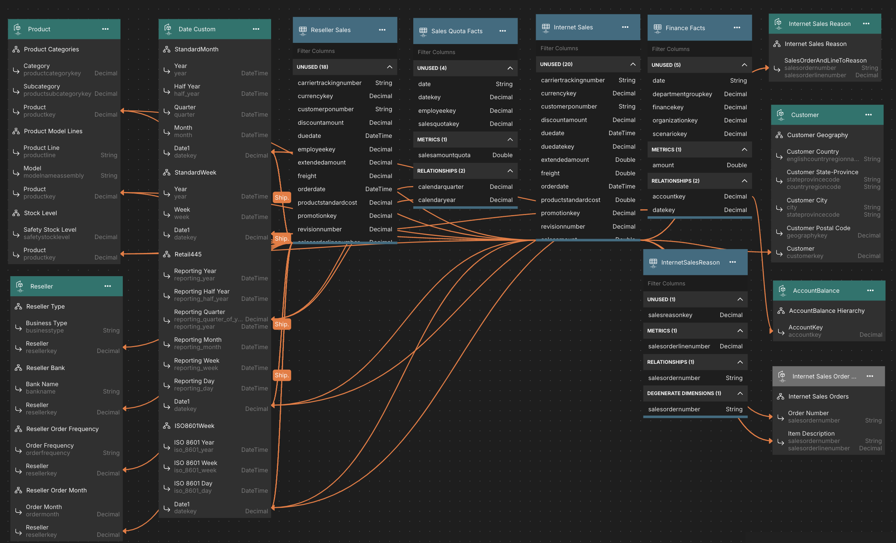

# AdventureWorks2012

AdventureWorks database is a Microsoft product sample that supports a fictitious multinational manufacturing company called Adventure Works Cycles.

## Demonstrated Model Features
1. Multi-fact model
2. Calculated Columns
3. Time-relative calculations
4. Query Dataset

## Supported Data Platforms
Any data platform that AtScale supports. To load supporting data:

1. Download data and database loading scripts for SQL Server-compatible data platforms [[here](https://github.com/Microsoft/sql-server-samples/releases/download/adventureworks/AdventureWorksDW-data-warehouse-install-script.zip). 
2. When loading data in your target platform, name the database/catalog `atscale_tutorial_data` and the schema `adventureworks2012`.

## Data Model Overview

